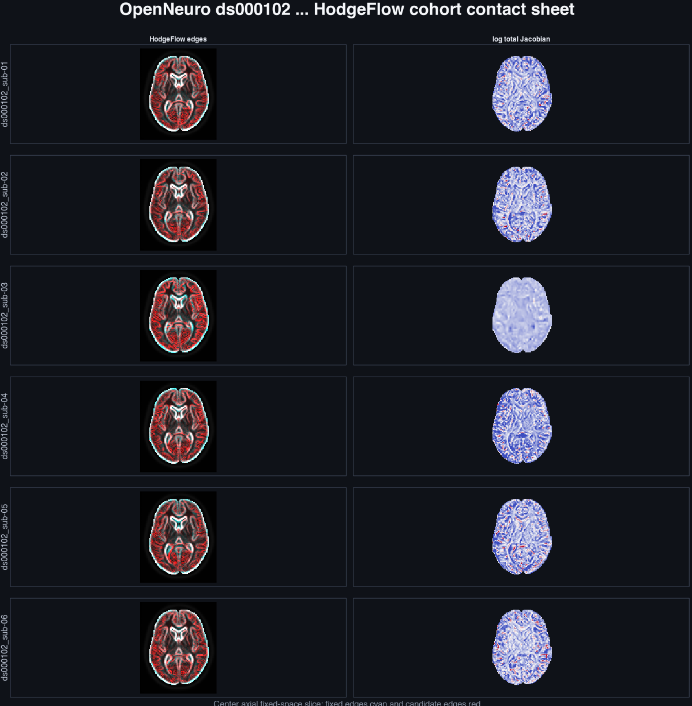
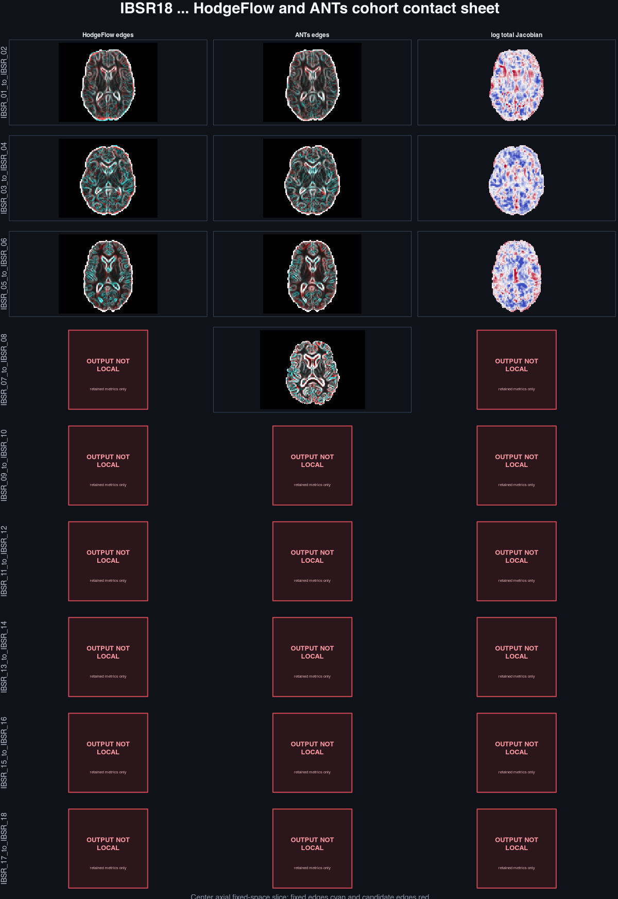

# External HodgeFlow visual QA reference

These images were produced by the adjacent **HodgeFlow project**. They do not
exercise or validate reframe4s HalfFlow or Flashalign. The primary
[HalfFlow and Flashalign QA report](real-world-registration-visual-qa.md) retains
only this repository's method status and links its synthetic Flashalign image.

The previously recorded image review covers 9 of 15 external method outputs:
six OpenNeuro T1-to-MNI cases and three IBSR18 pairs. Six further IBSR18 transforms
were unavailable in the local evidence bundle at the recorded review. Their
missing-output panels and metric rows remain visible here.

The [external rendering manifest](manifests/external-hodgeflow-visual-qa-v1.json),
[machine receipt](../../benchmarks/registration/external-references/hodgeflow/visual-qa/v1/receipt.json), and
[review record](../../benchmarks/registration/external-references/hodgeflow/visual-qa/v1/review.json) retain the external provenance,
source hashes, output hashes, coverage, and prior findings.

## Fixed review contract


Each detailed plate samples the 25th, 50th, and 75th percentiles of fixed-mask
indices along all three anatomical axes. All methods in a row use the identical
fixed-space slice. Intensities are independently clipped at their finite, nonzero
1st and 99th percentiles for display only.

Within the fixed mask, cyan edges come from the fixed image and red edges from the
candidate. Coincident edges approach white. Jacobian panels show the log total
pullback determinant clipped to `[-log(2), log(2)]`: blue is contraction, white is
unit determinant, red is expansion, and magenta is non-positive or non-finite.
Missing or rejected outputs receive explicit status panels and are never replaced
by a comparator.

The review checked orientation, global brain position and extent, major internal
edge agreement, catastrophic local deformation, and missing-artifact handling.
Those checks can find gross mistakes and suspicious transforms. They cannot replace
held-out anatomical labels, landmarks, inverse-consistency checks, or topology
certificates.

## OpenNeuro T1 to MNI

All six replayed HodgeFlow outputs correct the gross baseline displacement and place
the brain and major internal structures plausibly in MNI space. Masked post-fit NCC
ranges from 0.726 to 0.845; subject 03 is the weakest case. No fixed-mask Jacobian is
non-positive.

The topology tail still deserves attention. Five cases have 5.50% to 12.30% of
fixed-mask voxels below determinant 0.5. Minimum determinant ranges from 0.056 to
0.111 in those cases. Subject 03 instead has minimum 0.487 and almost no determinant
below 0.5, yet has the weakest masked NCC. This separation suggests both an
underfitting tail and an aggressive-contraction tail rather than one uniform failure
mode.



Detailed plates: [sub-01](../../benchmarks/registration/external-references/hodgeflow/visual-qa/v1/openneuro-ds000102/ds000102_sub-01.png),
[sub-02](../../benchmarks/registration/external-references/hodgeflow/visual-qa/v1/openneuro-ds000102/ds000102_sub-02.png),
[sub-03](../../benchmarks/registration/external-references/hodgeflow/visual-qa/v1/openneuro-ds000102/ds000102_sub-03.png),
[sub-04](../../benchmarks/registration/external-references/hodgeflow/visual-qa/v1/openneuro-ds000102/ds000102_sub-04.png),
[sub-05](../../benchmarks/registration/external-references/hodgeflow/visual-qa/v1/openneuro-ds000102/ds000102_sub-05.png), and
[sub-06](../../benchmarks/registration/external-references/hodgeflow/visual-qa/v1/openneuro-ds000102/ds000102_sub-06.png).

## IBSR18 labeled anatomy

The three locally replayable HodgeFlow transforms are orientation-correct and
grossly aligned. Their held-out label scores are more discriminating than the image
inspection: HodgeFlow improves over the shared affine for all three but trails ANTs
for both Dice and HD95.

| Pair | Affine Dice | HodgeFlow Dice | ANTs Dice | HodgeFlow HD95 | ANTs HD95 |
| --- | ---: | ---: | ---: | ---: | ---: |
| IBSR 01 to 02 | 0.574 | 0.666 | 0.743 | 3.52 mm | 2.96 mm |
| IBSR 03 to 04 | 0.473 | 0.583 | 0.719 | 4.22 mm | 2.80 mm |
| IBSR 05 to 06 | 0.627 | 0.656 | 0.717 | 6.96 mm | 6.51 mm |

Across all nine retained metric rows, mean Dice is 0.564 for affine, 0.648 for
HodgeFlow, and 0.722 for ANTs. HodgeFlow trails ANTs on every pair. Six completed
HodgeFlow transforms are absent from the local evidence bundle, so their numerical
rows remain visible while their method-image and Jacobian panels are marked
`OUTPUT NOT LOCAL`.



Detailed replayable plates: [IBSR 01 to 02](../../benchmarks/registration/external-references/hodgeflow/visual-qa/v1/ibsr18/IBSR_01_to_IBSR_02.png),
[IBSR 03 to 04](../../benchmarks/registration/external-references/hodgeflow/visual-qa/v1/ibsr18/IBSR_03_to_IBSR_04.png), and
[IBSR 05 to 06](../../benchmarks/registration/external-references/hodgeflow/visual-qa/v1/ibsr18/IBSR_05_to_IBSR_06.png).
The [IBSR 07 to 08 plate](../../benchmarks/registration/external-references/hodgeflow/visual-qa/v1/ibsr18/IBSR_07_to_IBSR_08.png)
shows how an available affine and ANTs result remain reviewable without filling the
missing HodgeFlow column.

## Reproduce external reference images

This opt-in manifest replays saved HodgeFlow results. It does not run either
reframe4s method. The default generator invocation renders only the primary QA.

```text
HODGEFLOW_ROOT=/path/to/hodgeflow Rscript --vanilla tools/registration/generate_real_world_registration_visual_qa.R docs/benchmarks/manifests/external-hodgeflow-visual-qa-v1.json
python3 tools/registration/validate_real_world_registration_registry.py
```
