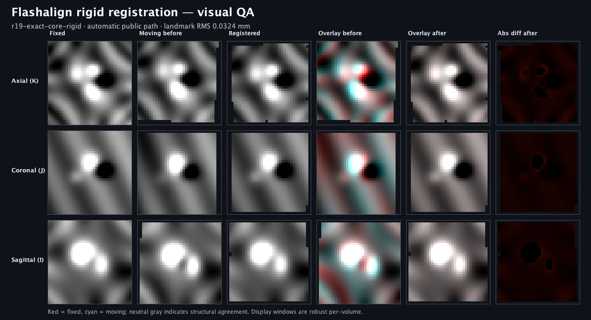

# Flashalign automatic rigid visual QA

This plate is a human-facing check of the complete public rigid workflow:
NIfTI load, automatic structural capture, rigid refinement, final pull
resampling of the original moving image, and orthogonal-slice rendering.



The `r19-exact-core-rigid` row is an analytic-synthetic image pair from the
final sealed v5 automatic release court. Flashalign recovered the sealed
moving-to-fixed transform with landmark RMS `0.0324168 mm`, projected-patch
objective `0.00128794`, and audit overlap fraction `1.0`. Across the displayed
axial, coronal, and sagittal center slices, robustly normalized mean absolute
difference changed as follows:

| Plane | Before | After |
| --- | ---: | ---: |
| Axial | 0.08669 | 0.02819 |
| Coronal | 0.08262 | 0.02842 |
| Sagittal | 0.06920 | 0.02805 |

The red-cyan panels use fixed signal in red and moving or registered signal in
cyan. Neutral gray indicates agreement. The difference panel emphasizes the
remaining absolute difference after registration. Invalid resampling support
is excluded from display normalization rather than treated as zero-valued
signal.

Generate the plate and its machine-readable manifest from the repository root:

```bash
sbt -J-Xmx4G -Dsbt.supershell=false \
  'flashalignBenchmarkJVM/runMain reframe4s.benchmark.flashalign.FlashalignVisualQa benchmarks/flashalign/visual-qa/r19-exact-core-rigid.png benchmarks/flashalign/visual-qa/r19-exact-core-rigid.manifest.json'
```

The runner checks the preserved raw-evidence, moving-image, fixed-image, and
result-transform SHA-256 values before rendering. Current artifact identities
are:

| Artifact | SHA-256 |
| --- | --- |
| Runner source | `c6e9c41a8ab68c187b40947492a22144a89236844131614280235aeb19cb3320` |
| PNG | `0af88e5a3bbd564856885760428cd8433ace686aaa0ca4a19eeda182e8d95804` |
| Manifest | `c591ac300e3ba228dfc144ac13e5893a7683df78ad3871c103b7223de169fa3d` |

Registration, image access, and final resampling use image4s and Reframe4s.
Java2D is used only inside the JVM benchmark runner to compose sampled slices
as a PNG. Reframe4s and Flashalign do not depend on ScalaFIM.

This demonstrates candidate `df4a4ddf84a63e5b7ae714a29b226d15639ce32bf8d583e3f08b931196442089`
through the intended path on a sealed analytic-synthetic rigid case.
It is not acquired-MRI, cross-modality, nonlinear, or clinical evidence. The
full numerical qualification remains the authority for cohort-level accuracy;
this plate makes one qualified result inspectable by a person.
