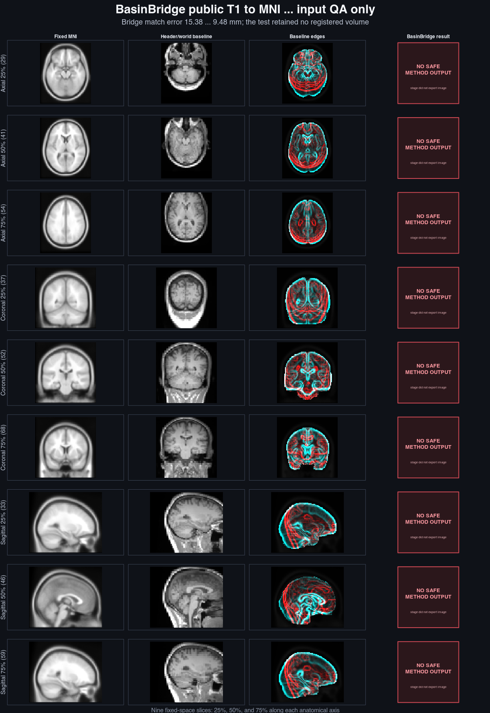
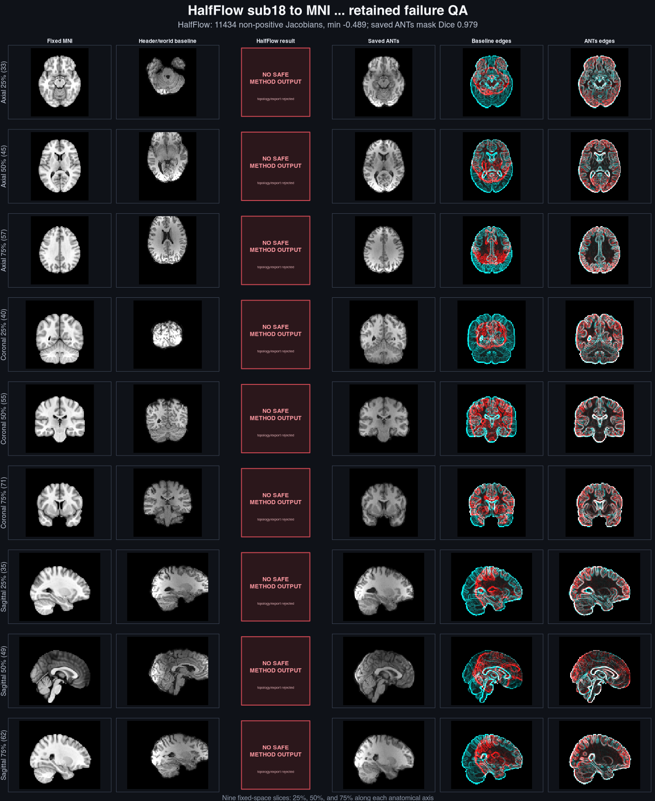

# HalfFlow and Flashalign registration visual QA

**There is no reviewable final acquired-image HalfFlow output in the two retained
cases (0/2). Flashalign's acquired nonlinear qualification is blocked before
execution. Neither method has an acquired-image visual pass in this bundle.**

The earlier version led with outputs from the adjacent HodgeFlow project. That
attribution was incorrect for this repository's method QA. Those images and
findings now live in an [external reference report](external-hodgeflow-visual-qa.md)
and a separate artifact directory; they do not validate HalfFlow or Flashalign.

This report complements the [real-world evidence registry](real-world-registration.md).
The [primary rendering manifest](manifests/real-world-registration-visual-qa-v1.json),
[machine receipt](../../benchmarks/registration/visual-qa/v1/receipt.json), and
[review record](../../benchmarks/registration/visual-qa/v1/review.json) cover only
the two HalfFlow fixture plates below. Inputs and comparator images remain
identified as such; neither occupies a method-result column.

## Method evidence

| Method and case | Data | Final method image | Evidence consequence |
| --- | --- | --- | --- |
| HalfFlow/BasinBridge public T1 to MNI | Acquired | Not retained; one bridge round only | Final alignment is not reviewable. |
| HalfFlow sub18 to MNI | Acquired | Rejected at topology/export | Retained failure; no visual pass. |
| Flashalign nonlinear qualification | Acquired court | No executed rows | Blocked before execution; no visual pass. |
| Flashalign automatic rigid, r19 | Analytic-synthetic | [Existing registered-image plate](../../benchmarks/flashalign/visual-qa/r19-exact-core-rigid.png) | Synthetic workflow evidence only; separate from the acquired cases. |

## HalfFlow acquired fixtures

The public T1 smoke fixture reduced sparse bridge match error from 15.38 to
9.48 mm, but stopped before exporting a complete transform or registered volume.
The plate shows fixed and baseline inputs with an explicit missing method panel.



The sub18 diagnostic failed topology and export. Its retained intermediate
endpoint had 11,434 non-positive sampled Jacobians and minimum -0.4891.
The saved ANTs image appears only as a comparator; it supplies no HalfFlow pass.



## Flashalign synthetic image

The existing [Flashalign rigid visual QA](flashalign-linear-visual-qa.md) shows
an actual Flashalign registered image from the analytic-synthetic
`r19-exact-core-rigid` case. It does not establish acquired-MRI or nonlinear
accuracy. The separate report records the runner, hashes, and numerical scope.


## Display and reproduction

The acquired fixture plates sample the 25th, 50th, and 75th percentiles of
fixed-mask indices along all three axes. Intensities are independently clipped
at their finite nonzero 1st and 99th percentiles for display. Fixed edges are
cyan and candidate edges are red. Missing or rejected outputs stay explicit.

The acquired inputs and saved ANTs comparator are stored in the adjacent data
tree, so regeneration uses `HODGEFLOW_ROOT` as a **fixture location**. It does
not run HodgeFlow or use a HodgeFlow registration as a HalfFlow result. The
primary manifest never renders the external HodgeFlow cohorts.

```text
HODGEFLOW_ROOT=/path/to/hodgeflow Rscript --vanilla tools/registration/generate_real_world_registration_visual_qa.R
python3 tools/registration/validate_real_world_registration_registry.py --write-doc
python3 tools/registration/validate_real_world_registration_registry.py
```

A future acquired comparison must run Flashalign and HalfFlow on the declared
cases and retain their own registered volumes, transforms, and failures.
Image inspection complements held-out labels or landmarks, bidirectional
residuals, coverage, and topology checks; these gaps remain open.
