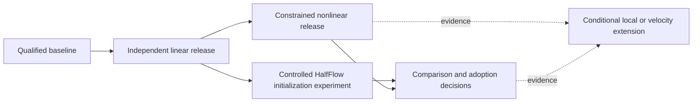

# Flashalign Mote implementation graph

Epic: **`bd-01M2B112XTRP60NNA2AMMPDKN8`**

Source: [implementation PRD v2](../flashalign-implementation-prd.md), SHA-256 `a66500fec106a0df0f6635bb81329f44cca0a031cab32958c6c370f2ca6fc929`.

Created 2026-09-12. Mote is the live work authority; this index and the [machine-readable graph](mote-plan.json) record the plan and audit.

The epic contains 53 required implementation/experiment tasks, four conditional tasks, five milestone/group records and one completed graph-planning task. All have the `flashalign` label.

**Edge semantics:** `task -> prerequisite` means the task is blocked by the prerequisite. Parent relations are separate non-blocking containment. The epic is blocked by G0, GL, GN and GC; conditional GF/F01-F04 are excluded.

The linear release closure is G0 plus B01-B05 and L01-L23. It contains no nonlinear, comparison or conditional task. Nonlinear and comparison milestones retain their own requirements; shared code is adopted through existing owners.

## Milestone overview



Arrows in this overview run from prerequisite to consumer. The JSON and Mote dependency commands use the opposite, consumer-to-prerequisite order.

## Ready now

```sh
mote ls --ready --tag flashalign
mote show bd-01M2B112XTRP60NNA2AMMPDKN8
```

- **FA-B01** `bd-01M2B113T9M7J6P83XG70PQ8JX` — Reconcile the existing architecture and build DAG
- **FA-B02** `bd-01M2B113Y1DHQMD52K75T2NF2X` — Align ownership CI inputs and settle toolchain/provider admission
- **FA-B05** `bd-01M2B114AZEZ1G6Q44G59F3F1M` — Freeze fixture, tolerance and benchmark evidence specifications

## Index

Each live issue body contains scope, PRD sections, planned areas, acceptance criteria, exact prerequisite IDs, evidence requirements and integration constraints. Required work is open. Optional decision tasks are dependency-blocked by GN/GC; optional implementation tasks remain explicitly blocked pending positive activation.

### Epic, milestones and graph-planning record

| Key | Mote ID | Task | Prerequisites |
|---|---|---|---|
| EPIC | `bd-01M2B112XTRP60NNA2AMMPDKN8` | EPIC: Flashalign fast linear alignment, constrained nonlinear extensions, and complementary-method reuse | G0, GL, GN, GC |
| G0 | `bd-01M2B113190WS6CHK5B324F8T5` | FA-G0: Admit the exact implementation baseline | B03 |
| GL | `bd-01M2B1134ZCW8RZPCAZBW01ZTQ` | FA-GL: Release the independently qualified fast linear product | L22, L23 |
| GN | `bd-01M2B1138PDKET2VY41A4WAWQ7` | FA-GN: Release the constrained nonlinear extension | GL, N14, N15, N16 |
| GC | `bd-01M2B113CPW0BDW29ZKR9VZ37H` | FA-GC: Complete complementary-method comparisons and adoption decisions | C09 |
| GF | `bd-01M2B113GZR83SBRQ3Q21CHEKK` | FA-GF: Conditional adaptive and velocity follow-ups | F01, F02, F03, F04 |
| PLAN | `bd-01M2B113PHTNAJB7YE8EXNWF6C` | FA-PLAN: Publish and audit the detailed Flashalign dependency graph | None |

### FA-G0: Admit the exact implementation baseline

| Key | Mote ID | Task | Prerequisites |
|---|---|---|---|
| B01 | `bd-01M2B113T9M7J6P83XG70PQ8JX` | Reconcile the existing architecture and build DAG | None |
| B02 | `bd-01M2B113Y1DHQMD52K75T2NF2X` | Align ownership CI inputs and settle toolchain/provider admission | None |
| B03 | `bd-01M2B114262AWWXQKSRE5TVAFQ` | Qualify the isolated baseline and unaffected consumer gates | B01, B02 |

### FA-GL: Release the independently qualified fast linear product

| Key | Mote ID | Task | Prerequisites |
|---|---|---|---|
| B04 | `bd-01M2B1146HMQV54YH5WQTT0N60` | Add the experimental Flashalign cross-project and typed API skeleton | G0 |
| B05 | `bd-01M2B114AZEZ1G6Q44G59F3F1M` | Freeze fixture, tolerance and benchmark evidence specifications | None |
| L01 | `bd-01M2B114EK4M149GAAZ8TJGXDZ` | Implement the scalar patch normalization and sign-mixture oracle | B04, B05 |
| L02 | `bd-01M2B114KAY698DFMNFZ1WMVEE` | Implement streamed rigid/affine sufficient statistics | L01 |
| L03 | `bd-01M2B114QZY1K213BF0508V0BT` | Specify and prove fused trilinear value/gradient semantics | G0, B05 |
| L04 | `bd-01M2B114VKG27ANATK8MG2M7DJ` | Compile allocation-bounded sparse value/gradient sampling | L03, B04 |
| L05 | `bd-01M2B114ZMGTZNVFPX0ENKT0Z6` | Add support-aware physical pyramid and PSF preparation | G0, B05 |
| L06 | `bd-01M2B11546HW4VPPF8CRCAAMZS` | Build screened physical patch populations | B04, L04, L05 |
| L07 | `bd-01M2B1157SE4NYGY8W02MYHQS2` | Implement frozen weighted sample sets and holdout roles | L06, B05 |
| L08 | `bd-01M2B115BGWNTNW4XAZG9R751R` | Deduplicate exact sample points and reuse affine stencil geometry | L06, L04 |
| L09 | `bd-01M2B115FNTEBWATG71TDVBNSJ` | Implement physical rigid updates and analytic intensity Jacobians | B04, L03 |
| L10 | `bd-01M2B115MQEBAXWRAS1NGXRX28` | Assemble the specialized rigid objective linearization | L02, L07, L08, L09 |
| L11 | `bd-01M2B115RV7F5B5QNMJH0HGMCD` | Implement bounded trust-region refinement and checkpoint semantics | L10 |
| L12 | `bd-01M2B115WSP4GJDZTM859WA497` | Implement loss-only trials and conservative early rejection | L01, L08, L11 |
| L13 | `bd-01M2B1160ESKN60KVN40A1TVFK` | Implement checked affine retraction and strain prior | L09, B04 |
| L14 | `bd-01M2B1164EJ3NBPVAPB6NQG8WR` | Integrate and qualify the 12-parameter affine engine | L12, L13 |
| L15 | `bd-01M2B1168QAVESSMFB8A2H0PEX` | Admit an exact CPU FFT provider for structural capture | B02, G0 |
| L16 | `bd-01M2B116D7RJZRAV5W2DTXKPN0` | Implement structural FFT translation and bounded rotation capture | L15, L04, L05, L14 |
| L17 | `bd-01M2B116JT6ZP5KYNDV7MJ8NVJ` | Implement linear selection, audit and regional QC | L14, L16, L07 |
| L18 | `bd-01M2B116QF782AWRSZBGMGXKMR` | Implement typed linear result records and canonical output | L14, B04 |
| L19 | `bd-01M2B116VB71VNF0HTRM9Y2RFR` | Build the independent pair benchmark runner and raw evidence schema | B04, B05, L18 |
| L20 | `bd-01M2B116ZF7SG4NQCAWXNM36TW` | Calibrate and freeze linear modality presets on training data | L17, L19 |
| L21 | `bd-01M2B1176364H28NG1DD0K11Q5` | Qualify the complete linear API across JVM and Scala.js | L18, L20, L12 |
| L22 | `bd-01M2B117AEXGBH91CYNTR47YA4` | Qualify linear phase costs and protect the fast path | L19, L20, L21 |
| L23 | `bd-01M2B117EC1FBBF37Y3V0VKHQY` | Run the sealed linear accuracy and 3dAllineate comparison | L19, L20, L21 |

### FA-GN: Release the constrained nonlinear extension

| Key | Mote ID | Task | Prerequisites |
|---|---|---|---|
| N01 | `bd-01M2B117KBMKQ28AP2ZCFF5ZDX` | Implement physical spectral bases, gauges and prior transport | L14, B05 |
| N02 | `bd-01M2B117QE199CYMVK44799YBH` | Implement typed point JVP/VJP geometry operations | B04, L09, L13 |
| N03 | `bd-01M2B117VB6MXNZFNJJAA9AHAQ` | Implement cached matrix-free projected-patch curvature and RHS | N02, L02, L07, L08, L10 |
| N04 | `bd-01M2B117ZY6KZKSQB35AVJ029G` | Qualify the Gale workspace PCG and preconditioner adapter | N03, G0 |
| N05 | `bd-01M2B11848SVBHCC6NZQY397MP` | Implement full-system pose elimination and physical damping | N04, N01, L11 |
| N06 | `bd-01M2B11886T05EMCPC6T80DY6H` | Implement the PE field, gauge, prior and directional derivatives | N01, N02, N03 |
| N07 | `bd-01M2B118CCKAGKA02JJB37TJT5` | Certify PE monotonicity and implement the bracketed inverse | N06 |
| N08 | `bd-01M2B118HZW9046EKXSBWQWDSE` | Integrate and falsify rigid-plus-PE registration | N07, N05, L12 |
| N09 | `bd-01M2B118PYR2SS5AB4ZFPM2T6G` | Implement small-strain vector modes and elastic prior | N01, N02, N03 |
| N10 | `bd-01M2B118TT16N43AHDJV8CWNBF` | Certify small-strain geometry and contraction inversion | N09 |
| N11 | `bd-01M2B118YVEFCRRQT9HRY3W2N8` | Integrate and qualify small-strain anatomical fitting | N10, N05, L12 |
| N12 | `bd-01M2B1192ZZM2W6AFM0DKG4729` | Implement information-supported model selection and nonlinear QC | N08, N11, L17, L20 |
| N13 | `bd-01M2B1197EC52V246FWZBHTB5Y` | Implement nonlinear records, inverse evidence and bounded output | N07, N10, L18 |
| N14 | `bd-01M2B119C7HRM7GQCQ206NPD2D` | Run independent nonlinear accuracy and failure-tail benchmarks | N12, N13, L19, L20 |
| N15 | `bd-01M2B119HRXM8151BKPCSM85QT` | Profile nonlinear operators, preconditioning and extension overhead | N12, N13, L22 |
| N16 | `bd-01M2B119P74DWQB1W9VEV4C3DJ` | Qualify nonlinear API, platforms and unaffected consumers | N13, N12, L21 |

### FA-GC: Complete complementary-method comparisons and adoption decisions

| Key | Mote ID | Task | Prerequisites |
|---|---|---|---|
| C01 | `bd-01M2B119TA9BS5MQXQRJGXZ3RP` | Extend the evidence runner with controlled cross-method lanes | L19, B05 |
| C02 | `bd-01M2B119YT1YVJ9SWD6X4Z38RG` | Qualify a frozen HalfFlow/BasinBridge comparison baseline | G0, C01 |
| C03 | `bd-01M2B11A3E11QC7HDQDAVWGYQG` | Add a canonical supplied-affine HalfFlow input adapter | L18, C02 |
| C04 | `bd-01M2B11A81SP5GJ1XCZP72S6VP` | Compare Flashalign initialization against the existing HalfFlow pipeline | C03, GL, C01 |
| C05 | `bd-01M2B11ABY5DY5A26XT9K2TBNT` | Compare economical and richer nonlinear models from the same affine | GN, C02, C01 |
| C06 | `bd-01M2B11AH7W6JBQ1XF15Y2CJHD` | Evaluate constrained pre-refinement followed by HalfFlow residual fitting | C05, C04, N13 |
| C07 | `bd-01M2B11ANS46TQV3W3XF5P0WP4` | Evaluate reverse geometry proposals without changing Flashalign model identity | C05, C01 |
| C08 | `bd-01M2B11AT1PEV62TJ3ZMHFJF6S` | Audit and adopt one justified shared primitive or document why none qualifies | L04, L05, C02, C01 |
| C09 | `bd-01M2B11AYPSF5433S1KBHP2QCN` | Synthesize complementary operating ranges and adoption decisions | C04, C05, C06, C07, C08 |

### FA-GF: Conditional adaptive and velocity follow-ups

| Key | Mote ID | Task | Prerequisites |
|---|---|---|---|
| F01 | `bd-01M2B11B2ND0KHDFQJSJ322RT6` | Decide whether local adaptive refinement has a supported use case | GN, GC |
| F02 | `bd-01M2B11B6QN4GMJBQ24MWDVH2G` | Implement local spline refinement only after a positive decision | F01 |
| F03 | `bd-01M2B11BB6FWN35SGHWCCRJVVY` | Decide whether a Flashalign velocity model adds value beyond HalfFlow | GN, GC |
| F04 | `bd-01M2B11BGNTS0Y11VPGRN4YP9V` | Implement sparse velocity flow only after a positive decision | F03 |

## Verified graph properties

- 64 nodes, 152 blocking edges and 63 parent relations; no dependency cycles.
- Every required implementation task is in the epic dependency closure.
- No conditional task or cross-method/nonlinear task is in the linear-release closure.
- Ready queue contains exactly B01, B02 and B05.
- All task bodies, labels, parent relations and prerequisite IDs match the live tracker.
- Existing issue summaries and the source PRD were preserved.
- Optional decision closure does not automatically activate its implementation; the explicit blocked state remains until a positive scoped decision.

The audit proves tracker structure and documented scope. It does not prove implementation correctness, numerical accuracy, runtime, remote CI or publication.
